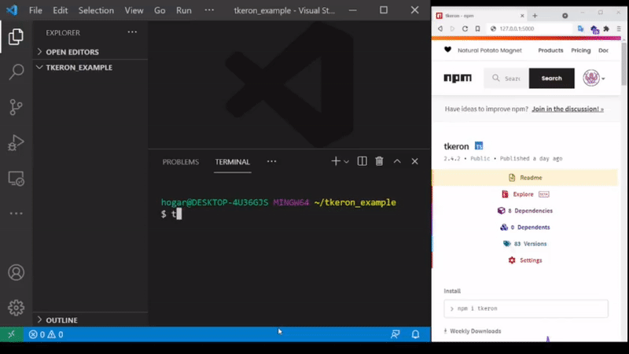

# Tkeron

Micro framework for developing web user interfaces with typescript.



**How to use**


---
- Install tkeron globally

```bash
npm i -g tkeron
```

---
- Enter in your project directory and run:

```bash
tkeron init
```

This will create a blank project in the "front" directory.

---
- To build the html file run this:

```bash
tkeron build
```

This will transpile the project in the directory "web"

---
- To run in your browser:

```bash
tkeron dev
```

This command will create a server on port 5000 for the "web" directory and will observe the file change in the "front" directory.

---
- to create a page use this:

```bash
tkeron generate page index
```

or its short version: 

```bash
tk g p index
```

---
- to create a component use this:

```bash
tkeron generate component my/button
```

or its short version: 

```bash
tk g c my/button
```


